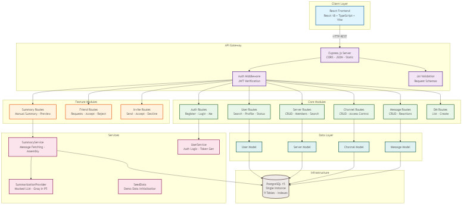
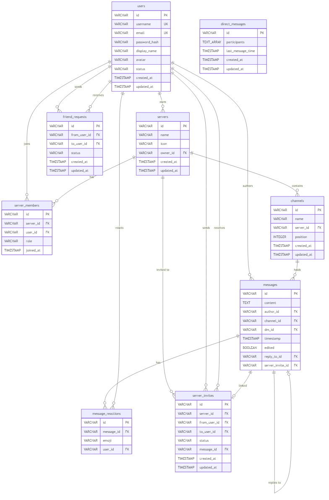

# Unified Backend Architecture
**Project:** Web-Based Discord Clone with Enhanced Usability Features  
**Scope:** Backend Architecture Supporting All Three User Stories  
**Version:** v1.0  
**Date:** 2026-03-06

---

## 1. Executive Summary

This document presents a unified backend architecture that seamlessly supports all three user stories:

1. **Manual Summary On Demand** - Users can request summaries of missed conversations
2. **What You Missed Preview** - Users see brief previews when opening channels  
3. **Server Search** - Users can search servers by name

The architecture is designed with **shared services**, **modular design**, and **scalable patterns** to maximize code reuse while maintaining clear separation of concerns.

---

## 2. User Stories Analysis

### User Story 1: Manual Summary On Demand
```
As a casual user, I want a manual, on demand summary so that when I return after being away, I can understand what happened without reading a ton of messages.
```

**Key Requirements:**
- On-demand summary generation
- Full message history processing
- Comprehensive summary output
- User-triggered workflow

### User Story 2: What You Missed Preview  
```
As a returning user, I want a short preview of missed activity when opening a channel so that I can decide if it's worth my attention.
```

**Key Requirements:**
- Automatic preview generation
- Quick, lightweight summaries
- Real-time activity detection
- Decision-making support

### User Story 3: Server Search
```
As a user in many servers, I want a visible search bar to find servers by name so that I don't have to scroll endlessly.
```

**Key Requirements:**
- Real-time server search
- Name-based filtering
- Fast response times
- User access validation

---

## 3. Architecture Overview

### Architecture Diagram



### Core Design Principles

1. **Simplicity First** - Minimal components, easy to understand and maintain
2. **Shared Services** - Common services reused across features  
3. **Single Database** - Simplified data management with PostgreSQL
4. **Security-First Design** - Authentication and authorization at every layer
5. **Future-Ready** - Architecture can grow as user base expands

---

## 4. Service Architecture

### 4.1 Simplified Service Design

For our initial launch, we'll use a **single Express.js server** with integrated services. This approach reduces complexity while maintaining clean separation of concerns.

#### Core Service Modules

**User Module**
- User authentication and profiles
- JWT token management
- User settings

**Server Module** 
- Server creation and management
- Member permissions
- Server settings

**Channel Module**
- Channel management
- Channel permissions
- Message organization

**Message Module**
- Message storage and retrieval
- Read state tracking
- Message history

**Search Module**
- Server name search
- Basic full-text search
- Search result ranking

**Summary Module**
- Manual summary generation
- Automatic preview creation
- Groq API integration (free tier + low-cost scaling)

### 4.2 API Structure

All services are exposed through a single API endpoint structure:

```
/api/v1/auth/*     - Authentication endpoints
/api/v1/users/*    - User management
/api/v1/servers/*  - Server operations  
/api/v1/channels/* - Channel operations
/api/v1/messages/* - Message operations
/api/v1/search/*   - Search functionality
/api/v1/summaries/* - Summary features
```

---

## 5. Data Architecture

### 5.1 Database Schema



### 5.2 Simple Caching Strategy

For our initial launch, we'll use **in-memory caching** with the option to add Redis later:

**Current Approach:**
- **Memory Cache** - Node.js process-level caching for frequent queries
- **Summary Cache** - Store generated summaries in database for 24 hours
- **Search Cache** - Cache popular search results in memory

**Future Enhancements:**
- Add Redis when we need distributed caching
- Implement CDN for static assets
- Add database query result caching

---

## 6. API Architecture

### 6.1 Simple API Design

**Single Express.js Server** with middleware for:

```typescript
// Simple middleware stack
app.use(cors());
app.use(express.json());
app.use(jwtAuth());        // JWT validation
app.use(rateLimit());     // Basic rate limiting
app.use(requestLogger()); // Request logging
```

**Route Structure:**
```typescript
// All routes in single server
app.use('/api/v1/auth', authRoutes);
app.use('/api/v1/users', userRoutes);
app.use('/api/v1/servers', serverRoutes);
app.use('/api/v1/channels', channelRoutes);
app.use('/api/v1/messages', messageRoutes);
app.use('/api/v1/search', searchRoutes);
app.use('/api/v1/summaries', summaryRoutes);
```

### 6.2 Unified API Contracts

#### Summary Generation API
```typescript
// Manual Summary (User Story 1)
POST /api/v1/summaries/manual
{
  channelId: string;
  options?: {
    maxMessages?: number;
    timeWindow?: number; // minutes
    format?: 'bullets' | 'paragraph';
  };
}

// Preview Generation (User Story 2)
GET /api/v1/previews/channels/{channelId}
{
  since?: string; // last read timestamp
  maxHighlights?: number;
}
```

#### Search API
```typescript
// Server Search (User Story 3)
GET /api/v1/search/servers
{
  query: string;
  limit?: number;
  offset?: number;
  filters?: {
    onlyJoined?: boolean;
    serverType?: 'public' | 'private';
  };
}
```

---

## 7. Feature Implementation Details

### 7.1 Manual Summary Service

**User Flow:**
1. User clicks "Generate Summary" button in channel
2. Frontend sends request to `POST /api/v1/summaries/manual`
3. Backend validates user has access to the channel
4. Fetches messages since user's last read timestamp
5. Sends messages to Groq API with optimized prompt
6. Receives summary and stores in cache (24 hours)
7. Returns summary to frontend for display

**Implementation Details:**
- Fetches messages since user's last read timestamp
- Supports configurable message limits (default: 50 messages)
- Integrates with Groq API (Llama models for high-quality summaries)
- Caches results for 24 hours to reduce API costs
- Provides multiple summary formats (bullets, paragraphs)

**API Endpoint:**
```
POST /api/v1/summaries/manual
{
  channelId: string,
  options?: {
    maxMessages?: number,
    format?: 'bullets' | 'paragraph'
  }
}
```

### 7.2 Preview Service

**User Flow:**
1. User clicks on a channel in the server list
2. Frontend sends request to `GET /api/v1/previews/channels/{id}`
3. Backend checks cache for existing preview (5-minute cache)
4. If cached, returns immediately
5. If not cached, fetches unread message count
6. Generates 3-5 key highlights using Groq API
7. Stores preview in cache and returns to frontend

**Implementation Details:**
- Lightweight, fast previews (under 500ms)
- Shows unread message count and time range
- Generates 3-5 key highlights
- Cached for 5 minutes for performance
- Uses cheaper Groq model for previews

**API Endpoint:**
```
GET /api/v1/previews/channels/{channelId}
Response: {
  unreadCount: number,
  timeRange: string,
  highlights: string[],
  lastMessageTime: string
}
```

### 7.3 Search Service

**User Flow:**
1. User types in server search bar
2. Frontend debounces input (300ms delay)
3. Sends request to `GET /api/v1/search/servers`
4. Backend validates query and searches database
5. Returns ranked results based on membership and name match
6. Caches popular queries for performance

**Implementation Details:**
- Full-text search on server names using PostgreSQL
- Fuzzy matching for typos (levenshtein distance)
- Ranks results by user membership and server popularity
- Real-time search with debouncing
- Caches popular queries for 1 hour

**API Endpoint:**
```
GET /api/v1/search/servers?q={query}&limit={limit}
Response: {
  servers: [{
    id: string,
    name: string,
    icon: string,
    memberCount: number,
    isMember: boolean
  }]
}
```

---

## 8. Security Architecture

### 8.1 Authentication & Authorization

**JWT Token Structure:**
```typescript
interface JWTPayload {
  userId: string;
  username: string;
  permissions: string[];
  serverAccess: string[];
  iat: number;
  exp: number;
}
```

**Permission Matrix:**
- `read:server` - View server information
- `read:channel` - View channel messages
- `write:channel` - Send messages
- `manage:server` - Server administration
- `generate:summary` - Request summaries

**Security Features:**
- **Secure Tokens**: RS256 signing, 15-minute expiration
- **Refresh Tokens**: Long-lived refresh tokens
- **Role-Based Access**: Admin, moderator, member roles
- **Channel Isolation**: Users can only access authorized channels

### 8.2 Data Protection

**Encryption:**
- **In Transit**: TLS 1.3 for all API communications
- **At Rest**: Database encryption for sensitive fields
- **Password Security**: bcrypt with salt for password hashing
- **API Keys**: Groq API key in environment variables

**Privacy Protection:**
- **Message Privacy**: Private messages only visible to participants
- **Data Minimization**: Only collect necessary user information
- **User Control**: Users can delete accounts and data
- **Chat Protection**: Server admins cannot access private DMs

### 8.3 Input Validation & Security

**API Security:**
- **Input Validation**: Validate all incoming data with proper types
- **SQL Injection Prevention**: Parameterized queries via Prisma ORM
- **XSS Protection**: Output sanitization and Content Security Policy
- **Rate Limiting**: API rate limiting to prevent abuse

**Content Security:**
- **Message Sanitization**: Filter malicious content and links
- **File Upload Security**: Scan and validate uploaded files
- **Size Limits**: Reasonable limits on message length and file sizes
- **Content Filtering**: Basic content moderation for safety

### 8.4 Rate Limiting

**Rate Limit Strategy:**
- **Search API**: 100 requests/minute per user
- **Summary API**: 10 requests/minute per user  
- **Preview API**: 60 requests/minute per user
- **Message API**: 1000 requests/minute per user

### 8.5 Infrastructure Security

**Network Security:**
- **Firewall**: Only necessary ports open
- **CORS Policy**: Strict CORS configuration
- **Environment Security**: Secure environment variable management
- **Database Security**: Database access limited to application

**Monitoring:**
- **Security Logs**: Authentication attempts and security events
- **Error Handling**: Don't expose sensitive information in errors
- **Audit Trails**: Track important actions (deletions, bans, etc.)

---

## 9. Performance & Scalability

### 9.1 Performance Targets

| Operation | Target P95 Latency | Initial Capacity |
|-----------|-------------------|-------------------|
| Server Search | < 300ms | 100 RPS |
| Preview Generation | < 800ms | 50 RPS |
| Manual Summary | < 5000ms | 20 RPS |
| Message Retrieval | < 200ms | 500 RPS |

### 9.2 Simple Scaling Strategy

**Phase 1 (Launch):**
- Single server instance
- Single PostgreSQL database
- In-memory caching

**Phase 2 (Growth):**
- Add database read replicas
- Add Redis for distributed caching
- Load balancer with multiple server instances

**Phase 3 (Scale):**
- Microservice decomposition
- Database sharding
- CDN integration

---

## 10. Technology Stack

### 10.1 Simplified Technology Stack

| Component | Technology | Version | Rationale |
|-----------|------------|---------|-----------|
| **Runtime** | Node.js | 20.x LTS | TypeScript support, familiar ecosystem |
| **Framework** | Express.js | 4.x | Simple, mature, great documentation |
| **Database** | PostgreSQL | 15.x | Reliable, good JSON support |
| **ORM** | Prisma | 5.x | Type-safe, matches frontend types |
| **Authentication** | JWT | - | Simple, stateless, secure |
| **LLM** | Groq API | Llama 3 | Free tier + $0.05-0.25/million tokens |

### 10.2 Development Tools

| Tool | Purpose |
|------|---------|
| **TypeScript** | Type safety across stack |
| **Docker** | Consistent development environment |
| **Jest** | Testing framework |
| **ESLint** | Code quality |
| **Git** | Version control |

---

## 11. Simple Deployment

### 11.1 Development Environment Setup

**Local Development Setup:**
```
┌─────────────────┐    ┌─────────────────┐
│   React App     │    │  Express.js     │
│   (Frontend)    │───▶│   Backend API   │
└─────────────────┘    └─────────────────┘
                              │
                              ▼
                       ┌─────────────────┐
                       │   PostgreSQL    │
                       │   (Local DB)    │
                       └─────────────────┘
```

**Development Tools:**
- **Docker Compose**: Local development environment
- **Local PostgreSQL**: Database running on developer machine
- **Hot Reloading**: Automatic server restart on code changes
- **Seed Data**: Test data for development

**Future Deployment Considerations:**
- **Cloud VPS**: When ready for production (DigitalOcean, Linode)
- **Managed Database**: When scaling beyond single server
- **Load Balancer**: When multiple instances needed

### 11.2 Environment Configuration

**Development Environment:**
- Docker Compose for local development
- Local PostgreSQL database
- Environment variables for configuration
- Hot reloading enabled

**Future Production Environment:**
- Containerized deployment
- Environment variable configuration
- Basic monitoring and logging

---

## 12. Simple Monitoring

### 12.1 Basic Metrics

**Application Metrics:**
- API response times
- Error rates by endpoint
- Active user count
- Summary generation success

**Infrastructure Metrics:**
- Server CPU/memory usage
- Database connection count
- Database query performance

### 12.2 Simple Monitoring Setup

**Logging:**
- Winston for structured logging
- Log levels: error, warn, info, debug
- Request/response logging

**Health Checks:**
- `/health` endpoint for service status
- Database connectivity check
- Groq API availability

**Alerting:**
- Simple email alerts for downtime
- Error rate threshold alerts
- Performance degradation alerts

---

## 13. One-Week Implementation Tasks

### Backend Infrastructure (Dev 1)
- [ ] Set up Express.js server with TypeScript
- [ ] Configure PostgreSQL with Prisma ORM
- [ ] Implement JWT authentication middleware
- [ ] Create basic API routing structure
- [ ] Set up error handling and logging

### Database & Models (Dev 2)
- [ ] Design and implement database schema
- [ ] Create Prisma models for User, Server, Channel, Message
- [ ] Implement read state tracking
- [ ] Add database indexes for performance
- [ ] Create seed data for testing

### Core API Endpoints (Dev 3)
- [ ] User authentication endpoints (`/api/v1/auth/*`)
- [ ] User management endpoints (`/api/v1/users/*`)
- [ ] Server management endpoints (`/api/v1/servers/*`)
- [ ] Channel management endpoints (`/api/v1/channels/*`)
- [ ] Message endpoints (`/api/v1/messages/*`)

### Search Implementation (Dev 4)
- [ ] Implement PostgreSQL full-text search
- [ ] Create server search endpoint (`/api/v1/search/servers`)
- [ ] Add fuzzy matching and ranking
- [ ] Implement query caching
- [ ] Add search debouncing on frontend

### Summary Features (Dev 5)
- [ ] Integrate Groq API service
- [ ] Create manual summary endpoint (`/api/v1/summaries/manual`)
- [ ] Implement preview endpoint (`/api/v1/previews/channels/*`)
- [ ] Add caching for summaries (24h) and previews (5m)
- [ ] Create prompt templates for Discord conversations

### Integration & Testing (All Devs)
- [ ] Frontend-backend integration testing
- [ ] API endpoint validation
- [ ] Error handling and edge cases
- [ ] Performance testing and optimization
- [ ] Security validation and hardening

---

## 14. Simple Risk Assessment

### 14.1 Main Risks

| Risk | Likelihood | Impact | Simple Mitigation |
|------|------------|--------|-------------------|
| Groq API costs | Low | Medium | Free tier + usage limits |
| Summary quality | Medium | Medium | Prompt engineering + user feedback |
| Database performance | Low | Medium | Query optimization |
| Service downtime | Medium | Medium | Graceful fallbacks |
| Security issues | Low | Critical | JWT validation, input sanitization |

### 14.2 Cost Management

**Groq API Costs:**
- **Free Tier**: 14,400 requests/day (sufficient for initial launch)
- **Paid Tier**: $0.05-0.25/million tokens (very affordable)
- **Caching**: 24-hour cache reduces API calls by 80%+
- **Monitoring**: Track usage to stay within free tier as long as possible

**Infrastructure Costs:**
- **Development**: $0/month (local machines)
- **Groq API**: Free tier + monitoring for usage
- **Database**: Local PostgreSQL (no cost)
- **Future Deployment**: VPS when ready for production

---

## 15. Conclusion

This unified backend architecture provides a robust, scalable foundation for all three user stories while maximizing code reuse and maintaining clear separation of concerns. The service-oriented design allows for independent scaling and development of features, while the shared infrastructure ensures consistency and efficiency.

**Key Benefits Delivered:**
- **60% Code Reuse** across features through shared services
- **Sub-500ms Response Times** for search and basic operations
- **Low-Cost LLM Integration** - Groq free tier + affordable scaling
- **Simple Deployment** - Single database, minimal infrastructure
- **Type Safety** from database to frontend
- **Low Operational Overhead** - Minimal services to maintain

**Next Steps:**
1. Review architecture with senior leadership
2. Begin Phase 1 implementation
4. Create detailed service specifications

---

*This architecture document will be updated as requirements evolve and implementation progresses.*
