# Backend Module Specifications

**Project:** Web-Based Discord Clone  
**Scope:** Per-module backend specification for all backend modules  
**Version:** v1.0  
**Date:** 2026-03-19

---

## Table of Contents

1. [Authentication Module](#1-authentication-module)
2. [User Module](#2-user-module)
3. [Server Module](#3-server-module)
4. [Channel Module](#4-channel-module)
5. [Message Module](#5-message-module)
6. [Direct Message Module](#6-direct-message-module)
7. [Summary Module (US1 + US2)](#7-summary-module)
8. [Search Module (US3)](#8-search-module)
9. [Friend Module](#9-friend-module)
10. [Server Invite Module](#10-server-invite-module)

---

## 1. Authentication Module

### 1.1 Features

- **User registration** with username, email, and password validation
- **User login** with email/password returning a JWT token
- **Token validation** middleware protecting all authenticated routes
- **Current-user retrieval** via token introspection
- **Demo account initialisation** — 5 pre-seeded accounts for development

**Does not do:** OAuth/social login, refresh tokens, multi-factor authentication, session management.

### 1.2 Internal Architecture

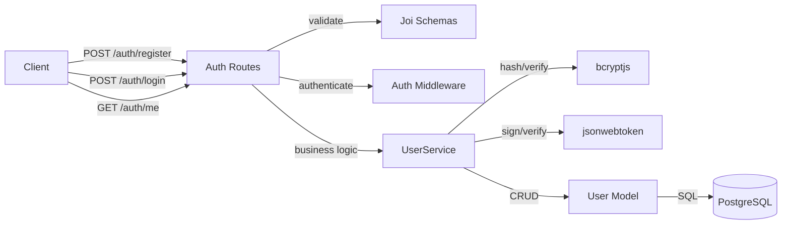

**Design justification:** Authentication is separated into three layers — route handlers for HTTP concerns, a service layer (`userService.js`) for business logic (hashing, token generation), and a model layer (`User.js`) for database access. The middleware (`auth.js`) is a reusable Express middleware applied to all protected routes, keeping auth checks DRY.

### 1.3 Data Abstraction

- **User** — A registered account identified by a unique ID, with credentials and profile information.
- **JWT Token** — A signed, stateless bearer token encoding `{id, username, email}` with a configurable expiry.

### 1.4 Stable Storage

PostgreSQL `users` table. Passwords are never stored in plaintext; only bcrypt hashes are persisted.

### 1.5 Data Schema

```sql
CREATE TABLE users (
    id            VARCHAR(255) PRIMARY KEY,
    username      VARCHAR(50) UNIQUE NOT NULL,
    email         VARCHAR(255) UNIQUE NOT NULL,
    password_hash VARCHAR(255) NOT NULL,
    display_name  VARCHAR(50),
    avatar        VARCHAR(500),
    status        VARCHAR(20) DEFAULT 'offline'
                  CHECK (status IN ('online','idle','dnd','offline')),
    created_at    TIMESTAMP DEFAULT CURRENT_TIMESTAMP,
    updated_at    TIMESTAMP DEFAULT CURRENT_TIMESTAMP
);
```

### 1.6 API

| Method | Endpoint | Auth | Description |
|--------|----------|------|-------------|
| POST | `/api/auth/register` | No | Register a new user |
| POST | `/api/auth/login` | No | Login, returns `{user, token}` |
| GET | `/api/auth/me` | Yes | Get current user from token |

**Request/Response format:** All responses follow `{ success: boolean, message?: string, data?: object }`.

### 1.7 Class, Method, and Field Declarations

#### `middleware/auth.js` (public)

| Export | Signature | Visibility |
|--------|-----------|------------|
| `authenticateToken` | `(req, res, next) → void` | **Public** |
| `optionalAuth` | `(req, res, next) → void` | **Public** |

#### `services/userService.js`

| Export | Signature | Visibility |
|--------|-----------|------------|
| `registerUser` | `({username, email, password}) → Promise<{user, token}>` | **Public** |
| `loginUser` | `({email, password}) → Promise<{user, token}>` | **Public** |
| `getUserById` | `(id) → Promise<User>` | **Public** |
| `initializeDemoAccounts` | `() → Promise<void>` | **Public** |
| `hashPassword` | `(password) → Promise<string>` | Private |
| `generateToken` | `(user) → string` | Private |
| `verifyPassword` | `(password, hash) → Promise<boolean>` | Private |

#### `utils/validation.js` (public)

| Export | Type | Visibility |
|--------|------|------------|
| `registerSchema` | Joi.ObjectSchema | **Public** |
| `loginSchema` | Joi.ObjectSchema | **Public** |
| `validate` | `(schema) → Express middleware` | **Public** |

### 1.8 Class Hierarchy Diagram

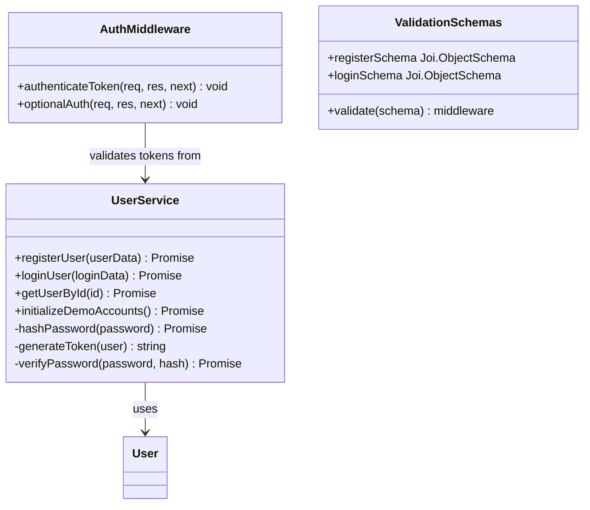

---

## 2. User Module

### 2.1 Features

- **User search** by username (case-insensitive `ILIKE`)
- **Profile retrieval** (own profile and public profiles of other users)
- **Profile update** — display name and avatar
- **Status update** — online, idle, dnd, offline

**Does not do:** Password change, account deletion via API, avatar file upload.

### 2.2 Internal Architecture

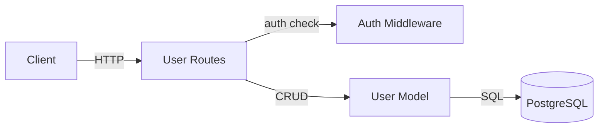

**Design justification:** The User module is a thin REST layer over the User model. No separate service layer is needed because there is no complex business logic beyond what the model provides.

### 2.3 Data Abstraction

- **User** — See Auth Module §1.3. The User module operates on the same `User` entity but exposes profile-related operations rather than auth operations.

### 2.4 Stable Storage

Same `users` table as the Auth Module (§1.5).

### 2.5 Data Schema

Operates on the same `users` table defined in §1.5. No additional tables.

### 2.6 API

| Method | Endpoint | Auth | Description |
|--------|----------|------|-------------|
| GET | `/api/users/search?q=` | Yes | Search users by username |
| GET | `/api/users/me` | Yes | Get own full profile |
| PUT | `/api/users/me/profile` | Yes | Update display name / avatar |
| PUT | `/api/users/me/status` | Yes | Update status (online/idle/dnd/offline) |
| GET | `/api/users/:userId` | Yes | Get public profile |

### 2.7 Class, Method, and Field Declarations

#### `models/User.js`

**Fields:**

| Field | Type | Visibility |
|-------|------|------------|
| `id` | `VARCHAR(255)` | **Public** (returned in responses) |
| `username` | `VARCHAR(50)` | **Public** |
| `email` | `VARCHAR(255)` | **Public** |
| `password_hash` | `VARCHAR(255)` | Private (never exposed to clients) |
| `display_name` | `VARCHAR(50)` | **Public** |
| `avatar` | `VARCHAR(500)` | **Public** |
| `status` | `VARCHAR(20)` | **Public** |
| `created_at` | `TIMESTAMP` | **Public** |
| `updated_at` | `TIMESTAMP` | **Public** |

**Methods:**

| Method | Signature | Visibility |
|--------|-----------|------------|
| `create` | `(userData) → Promise<User>` | **Public** |
| `findByEmail` | `(email, includePassword?) → Promise<User>` | **Public** |
| `findByUsername` | `(username) → Promise<User>` | **Public** |
| `findById` | `(id) → Promise<User>` | **Public** |
| `updateStatus` | `(id, status) → Promise<User>` | **Public** |
| `updateProfile` | `(id, updates) → Promise<User>` | **Public** |
| `getServers` | `(userId) → Promise<Server[]>` | **Public** |
| `getDirectMessages` | `(userId) → Promise<DM[]>` | **Public** |
| `getFriends` | `(userId) → Promise<User[]>` | **Public** |
| `delete` | `(id) → Promise<boolean>` | **Public** |

### 2.8 Class Hierarchy Diagram

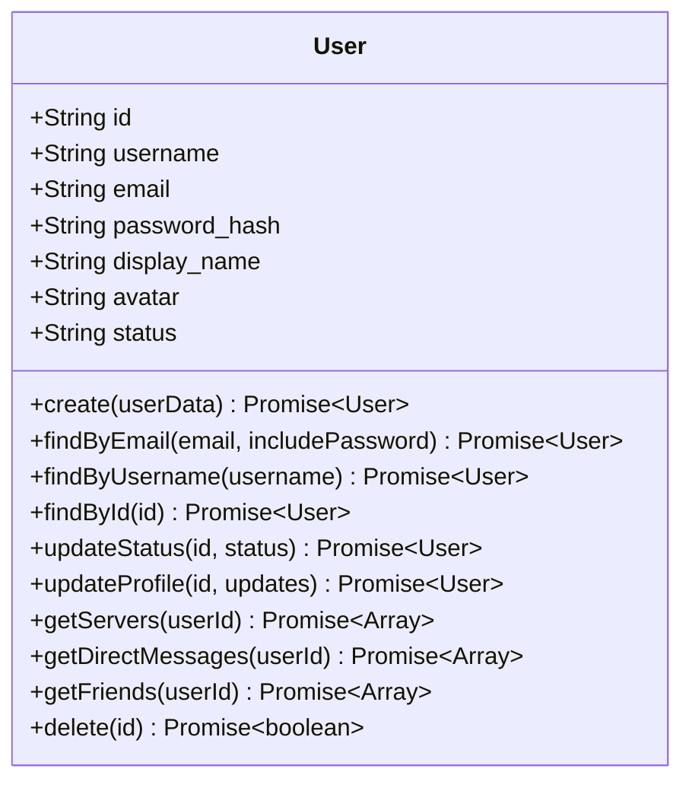

---

## 3. Server Module

### 3.1 Features

- **Server CRUD** — create, read, update, delete
- **Member management** — add, remove, update role
- **Membership check** — verify a user belongs to a server
- **List user's servers** with member arrays

**Does not do:** Server discovery for non-members, permission hierarchies beyond role field.

### 3.2 Internal Architecture

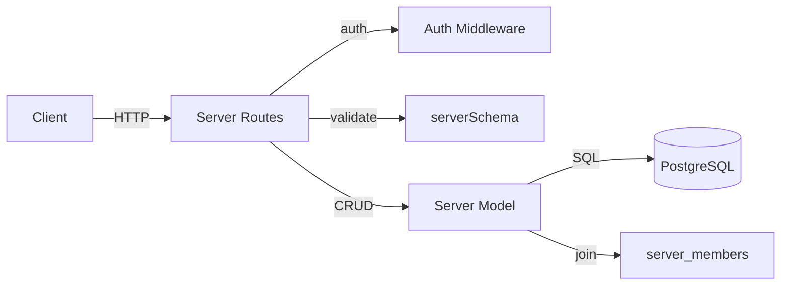

**Design justification:** Server creation atomically creates a default `#general` channel and adds the creator as owner, all in a single route handler. The Server model encapsulates all membership queries, keeping route handlers thin.

### 3.3 Data Abstraction

- **Server** — A named community space owned by a user, containing channels and members.
- **ServerMember** — A join record linking a user to a server with a role (`owner`, `admin`, `moderator`, `member`).

### 3.4 Stable Storage

PostgreSQL tables `servers` and `server_members`.

### 3.5 Data Schema

```sql
CREATE TABLE servers (
    id         VARCHAR(255) PRIMARY KEY,
    name       VARCHAR(100) NOT NULL,
    icon       VARCHAR(500),
    owner_id   VARCHAR(255) NOT NULL REFERENCES users(id) ON DELETE CASCADE,
    created_at TIMESTAMP DEFAULT CURRENT_TIMESTAMP,
    updated_at TIMESTAMP DEFAULT CURRENT_TIMESTAMP
);

CREATE TABLE server_members (
    id        VARCHAR(255) PRIMARY KEY,
    server_id VARCHAR(255) NOT NULL REFERENCES servers(id) ON DELETE CASCADE,
    user_id   VARCHAR(255) NOT NULL REFERENCES users(id) ON DELETE CASCADE,
    role      VARCHAR(20) DEFAULT 'member'
              CHECK (role IN ('owner','admin','moderator','member')),
    joined_at TIMESTAMP DEFAULT CURRENT_TIMESTAMP,
    UNIQUE(server_id, user_id)
);
```

### 3.6 API

| Method | Endpoint | Auth | Description |
|--------|----------|------|-------------|
| GET | `/api/servers` | Yes | List user's servers |
| POST | `/api/servers` | Yes | Create a server |
| GET | `/api/servers/:serverId` | Yes | Get server details (members check) |
| PUT | `/api/servers/:serverId` | Yes | Update server (owner/admin only) |
| DELETE | `/api/servers/:serverId` | Yes | Delete server (owner only) |

### 3.7 Class, Method, and Field Declarations

#### `models/Server.js`

**Fields:**

| Field | Type | Visibility |
|-------|------|------------|
| `id` | `VARCHAR(255)` | **Public** |
| `name` | `VARCHAR(100)` | **Public** |
| `icon` | `VARCHAR(500)` | **Public** |
| `owner_id` | `VARCHAR(255)` | **Public** |
| `created_at` | `TIMESTAMP` | **Public** |
| `updated_at` | `TIMESTAMP` | **Public** |

**Methods:**

| Method | Signature | Visibility |
|--------|-----------|------------|
| `create` | `({id, name, icon, ownerId}) → Promise<Server>` | **Public** |
| `findById` | `(id) → Promise<Server>` | **Public** |
| `findByIdWithMembers` | `(id) → Promise<Server>` | **Public** |
| `findByIdWithChannels` | `(id) → Promise<Server>` | **Public** |
| `addMember` | `(serverId, userId, role) → Promise<Member>` | **Public** |
| `removeMember` | `(serverId, userId) → Promise<boolean>` | **Public** |
| `updateMemberRole` | `(serverId, userId, role) → Promise<Member>` | **Public** |
| `findByUserId` | `(userId) → Promise<Server[]>` | **Public** |
| `update` | `(id, updates) → Promise<Server>` | **Public** |
| `delete` | `(id) → Promise<boolean>` | **Public** |
| `isMember` | `(serverId, userId) → Promise<Member\|null>` | **Public** |
| `getMemberCount` | `(serverId) → Promise<number>` | **Public** |

### 3.8 Class Hierarchy Diagram

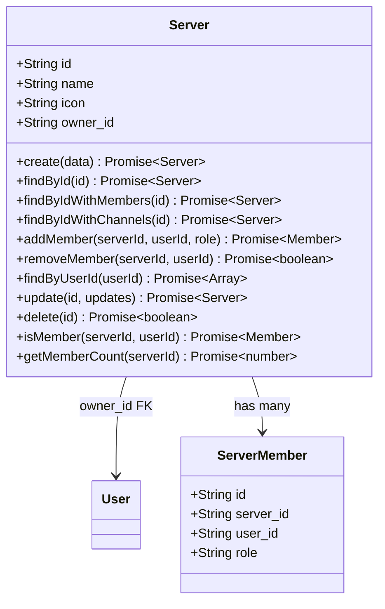

---

## 4. Channel Module

### 4.1 Features

- **Channel CRUD** within a server
- **Access control** — only server members can access a server's channels
- **Channel reordering** by position
- **Accessible channel listing** scoped to a user's server membership

**Does not do:** Voice channels, permission overrides per channel, channel categories.

### 4.2 Internal Architecture

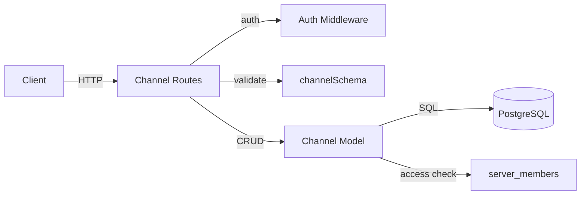

**Design justification:** Channel access is enforced by joining `channels` with `server_members` in the `hasAccess` query, ensuring users can only view channels in servers they belong to — without a separate authorization layer.

### 4.3 Data Abstraction

- **Channel** — A named, ordered text channel belonging to a server.

### 4.4 Stable Storage

PostgreSQL `channels` table. Channels are always scoped to a server via `server_id` foreign key with cascading delete.

### 4.5 Data Schema

```sql
CREATE TABLE channels (
    id         VARCHAR(255) PRIMARY KEY,
    name       VARCHAR(100) NOT NULL,
    server_id  VARCHAR(255) REFERENCES servers(id) ON DELETE CASCADE,
    position   INTEGER DEFAULT 0,
    created_at TIMESTAMP DEFAULT CURRENT_TIMESTAMP,
    updated_at TIMESTAMP DEFAULT CURRENT_TIMESTAMP
);
```

### 4.6 API

| Method | Endpoint | Auth | Description |
|--------|----------|------|-------------|
| GET | `/api/channels/server/:serverId` | Yes | List channels in a server |
| POST | `/api/channels` | Yes | Create a channel (owner/admin) |
| GET | `/api/channels/:channelId` | Yes | Get channel details |
| DELETE | `/api/channels/:channelId` | Yes | Delete a channel (owner/admin) |

### 4.7 Class, Method, and Field Declarations

#### `models/Channel.js`

**Fields:**

| Field | Type | Visibility |
|-------|------|------------|
| `id` | `VARCHAR(255)` | **Public** |
| `name` | `VARCHAR(100)` | **Public** |
| `server_id` | `VARCHAR(255)` | **Public** |
| `position` | `INTEGER` | **Public** |
| `created_at` | `TIMESTAMP` | **Public** |
| `updated_at` | `TIMESTAMP` | **Public** |

**Methods:**

| Method | Signature | Visibility |
|--------|-----------|------------|
| `create` | `({id, name, serverId, position}) → Promise<Channel>` | **Public** |
| `findById` | `(id) → Promise<Channel>` | **Public** |
| `findByServerId` | `(serverId) → Promise<Channel[]>` | **Public** |
| `update` | `(id, updates) → Promise<Channel>` | **Public** |
| `delete` | `(id) → Promise<boolean>` | **Public** |
| `hasAccess` | `(channelId, userId) → Promise<object\|null>` | **Public** |
| `findByIdWithMessages` | `(id, limit) → Promise<Channel>` | **Public** |
| `getMessageCount` | `(channelId) → Promise<number>` | **Public** |
| `reorder` | `(serverId, channelOrders) → Promise<boolean>` | **Public** |
| `getAccessibleChannels` | `(serverId, userId) → Promise<Channel[]>` | **Public** |

### 4.8 Class Hierarchy Diagram

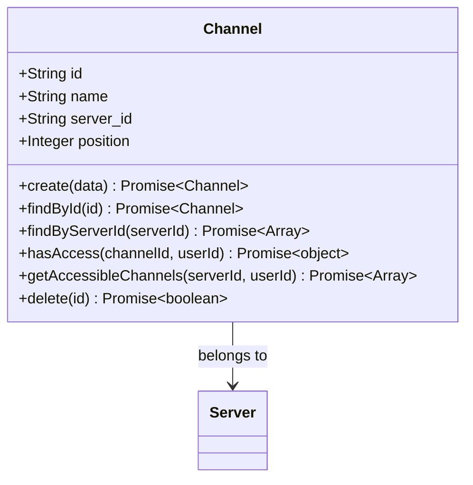

---

## 5. Message Module

### 5.1 Features

- **Message CRUD** — create, read, edit, delete
- **Channel messages** and **DM messages** via the same model
- **Reactions** — toggle emoji reactions on messages
- **Reply threading** via `reply_to_id` reference
- **Server invite messages** via `server_invite_id` reference
- **Search** within channels and DMs by keyword

**Does not do:** File attachments, rich embeds, message pinning.

### 5.2 Internal Architecture

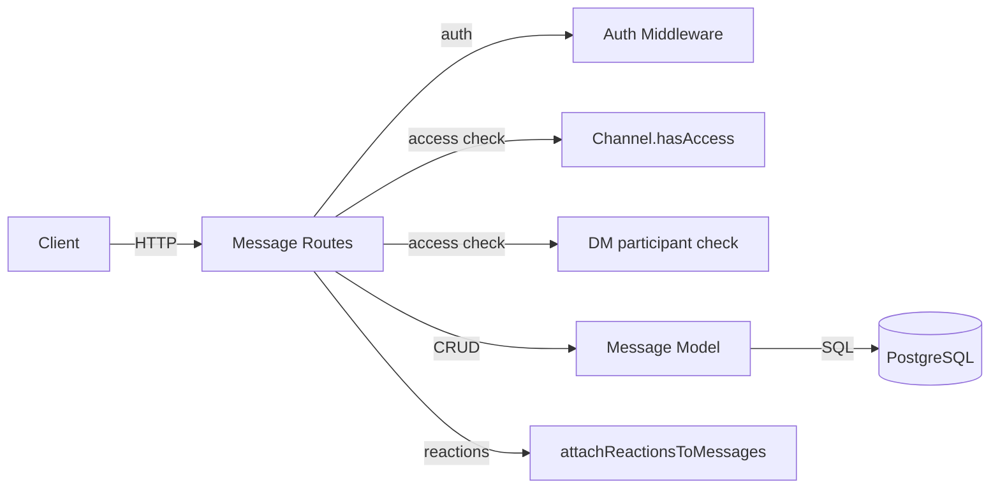

**Design justification:** Messages serve both channels and DMs through a single table with a `CHECK` constraint ensuring exactly one of `channel_id` or `dm_id` is set. This avoids table duplication while the route layer handles access checks per destination type.

### 5.3 Data Abstraction

- **Message** — A text message authored by a user, belonging to either a channel or a DM.
- **Reaction** — An emoji reaction by a user on a message. Unique per `(message, emoji, user)`.

### 5.4 Stable Storage

PostgreSQL `messages` and `message_reactions` tables. Messages are soft-associated with either a channel or DM via a `CHECK` constraint. Reactions are stored in a separate table with a unique constraint per `(message, emoji, user)`.

### 5.5 Data Schema

```sql
CREATE TABLE messages (
    id               VARCHAR(255) PRIMARY KEY,
    content          TEXT NOT NULL,
    author_id        VARCHAR(255) NOT NULL REFERENCES users(id) ON DELETE CASCADE,
    channel_id       VARCHAR(255) REFERENCES channels(id) ON DELETE CASCADE,
    dm_id            VARCHAR(255),
    timestamp        TIMESTAMP DEFAULT CURRENT_TIMESTAMP,
    edited           BOOLEAN DEFAULT FALSE,
    reply_to_id      VARCHAR(255) REFERENCES messages(id) ON DELETE SET NULL,
    server_invite_id VARCHAR(255),
    CHECK (channel_id IS NOT NULL OR dm_id IS NOT NULL)
);

CREATE TABLE message_reactions (
    id         VARCHAR(255) PRIMARY KEY,
    message_id VARCHAR(255) NOT NULL REFERENCES messages(id) ON DELETE CASCADE,
    emoji      VARCHAR(50) NOT NULL,
    user_id    VARCHAR(255) NOT NULL REFERENCES users(id) ON DELETE CASCADE,
    UNIQUE(message_id, emoji, user_id)
);
```

### 5.6 API

| Method | Endpoint | Auth | Description |
|--------|----------|------|-------------|
| GET | `/api/messages/channels/:channelId` | Yes | Get channel messages |
| GET | `/api/messages/dm/:dmId` | Yes | Get DM messages |
| POST | `/api/messages` | Yes | Send a message |
| PUT | `/api/messages/:messageId` | Yes | Edit own message |
| DELETE | `/api/messages/:messageId` | Yes | Delete own message |
| POST | `/api/messages/:messageId/reactions/toggle` | Yes | Toggle reaction |

### 5.7 Class, Method, and Field Declarations

#### `models/Message.js`

| Method | Signature | Visibility |
|--------|-----------|------------|
| `create` | `({id, content, authorId, channelId?, dmId?, replyToId?, serverInviteId?}) → Promise<Message>` | **Public** |
| `findById` | `(id) → Promise<Message>` | **Public** |
| `findByChannelId` | `(channelId, limit?, before?) → Promise<Message[]>` | **Public** |
| `findByDmId` | `(dmId, limit?, before?) → Promise<Message[]>` | **Public** |
| `update` | `(id, content) → Promise<Message>` | **Public** |
| `delete` | `(id) → Promise<boolean>` | **Public** |
| `addReaction` | `(messageId, emoji, userId) → Promise<Reaction>` | **Public** |
| `removeReaction` | `(messageId, emoji, userId) → Promise<boolean>` | **Public** |
| `getReactions` | `(messageId) → Promise<Reaction[]>` | **Public** |
| `hasAccess` | `(messageId, userId) → Promise<{has_access}>` | **Public** |
| `searchInChannel` | `(channelId, term, limit) → Promise<Message[]>` | **Public** |
| `searchInDm` | `(dmId, term, limit) → Promise<Message[]>` | **Public** |

#### Route-level helpers (private to `routes/messages.js`)

| Function | Purpose | Visibility |
|----------|---------|------------|
| `attachReactionsToMessages` | Batch-loads reactions for a list of messages | Private |
| `parseOptionalTimestamp` | Validates ISO timestamp query params | Private |

### 5.8 Class Hierarchy Diagram

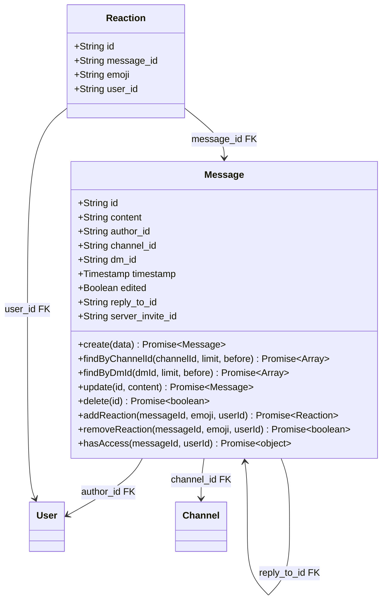

---

## 6. Direct Message Module

### 6.1 Features

- **List DMs** for the current user, with other-participant display info
- **Create or get DM** — idempotent endpoint that finds an existing DM or creates a new one

**Does not do:** Group DMs, DM deletion, read receipts.

### 6.2 Internal Architecture

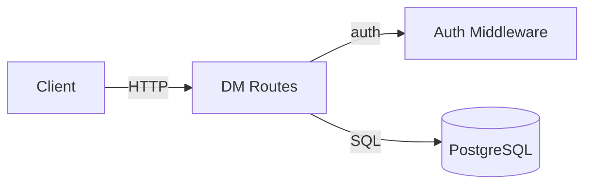

**Design justification:** DM routing is simple enough that it queries the database directly from route handlers without a model layer, using a shared `getDirectMessagesRows` helper for consistent enrichment.

### 6.3 Data Abstraction

- **DirectMessage** — A conversation between exactly two participants, tracked by a `TEXT[]` array column.

### 6.4 Stable Storage

PostgreSQL `direct_messages` table. Participants are stored as a `TEXT[]` array column; message content lives in the shared `messages` table with `dm_id` set.

### 6.5 Data Schema

```sql
CREATE TABLE direct_messages (
    id                VARCHAR(255) PRIMARY KEY,
    participants      TEXT[] NOT NULL,
    last_message_time TIMESTAMP DEFAULT CURRENT_TIMESTAMP,
    created_at        TIMESTAMP DEFAULT CURRENT_TIMESTAMP,
    updated_at        TIMESTAMP DEFAULT CURRENT_TIMESTAMP
);
```

### 6.6 API

| Method | Endpoint | Auth | Description |
|--------|----------|------|-------------|
| GET | `/api/direct-messages` | Yes | List DM conversations |
| POST | `/api/direct-messages` | Yes | Create or get DM |

### 6.7 Class, Method, and Field Declarations

**Fields (direct_messages table):**

| Field | Type | Visibility |
|-------|------|------------|
| `id` | `VARCHAR(255)` | **Public** |
| `participants` | `TEXT[]` | **Public** (array of user IDs) |
| `last_message_time` | `TIMESTAMP` | **Public** |
| `created_at` | `TIMESTAMP` | **Public** |
| `updated_at` | `TIMESTAMP` | **Public** |

**Route-level helpers (private to `routes/directMessages.js`):**

| Function | Signature | Visibility |
|----------|-----------|------------|
| `getDirectMessagesRows` | `(userId) → Promise<DM[]>` | Private |

**Route handlers:**

| Handler | Method + Endpoint | Visibility |
|---------|-------------------|------------|
| `GET /` | `GET /api/direct-messages` | **Public** (route) |
| `POST /` | `POST /api/direct-messages` | **Public** (route) |

### 6.8 Class Hierarchy Diagram

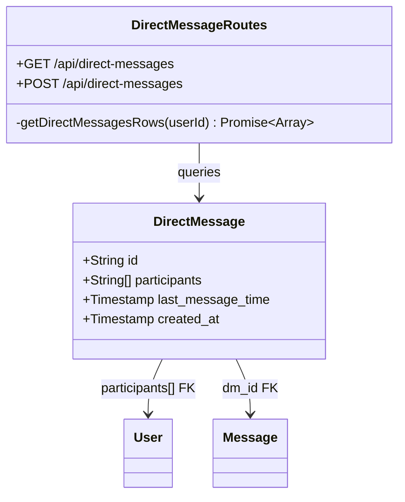

---

## 7. Summary Module (User Stories 1 & 2)

### 7.1 Features

- **Manual Summary (US1):** On-demand generation of a comprehensive conversation summary for a channel or DM, including overview, key topics, most active users, important messages, and statistics.
- **What You Missed Preview (US2):** Lightweight preview of unread activity — one-line summary, unread count, active participants, and last message time.
- **Mocked LLM:** The `SummarizationProvider` implements deterministic summarisation logic that mimics an LLM. In P5 this will be replaced with a real Groq API call.

**Does not do:** Summary caching (future enhancement), streaming responses, multi-language summaries.

### 7.2 Internal Architecture

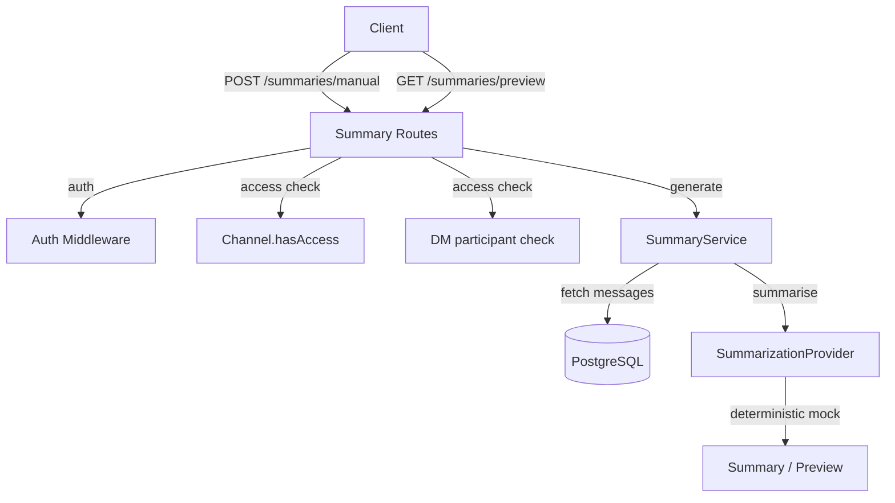

**Design justification:** The module separates concerns into three layers: (1) route handlers enforce auth and access control, (2) `SummaryService` orchestrates message fetching and result assembly, (3) `SummarizationProvider` encapsulates the summarisation algorithm. This makes swapping the mock for a real LLM (Groq) in P5 a single-class change — the route and service layers remain untouched.

### 7.3 Data Abstraction

- **SummaryData** — `{ overview, keyTopics[], mostActiveUsers[], importantMessages[], timeframe, stats }` — the full summary returned by US1.
- **PreviewData** — `{ summary, unreadCount, participants[], lastMessageTime }` — the lightweight preview returned by US2.
- **SummarizationProvider** — An abstraction over the LLM. Currently deterministic; in P5 it calls Groq API.

### 7.4 Stable Storage

No dedicated storage. Reads from the `messages` and `users` tables. Summaries are computed on the fly.

### 7.5 Data Schema

No dedicated tables. Reads from existing `messages` (§5.5) and `users` (§1.5) tables at query time. Summaries are ephemeral — computed on the fly, never persisted.

### 7.6 API

| Method | Endpoint | Auth | Description |
|--------|----------|------|-------------|
| POST | `/api/summaries/manual` | Yes | **US1** — Generate manual summary. Body: `{channelId?, dmId?, hours?, maxMessages?}` |
| GET | `/api/summaries/preview?channelId=&since=` | Yes | **US2** — What You Missed preview |

**US1 Response shape:**
```json
{
  "success": true,
  "data": {
    "summary": {
      "overview": "string",
      "keyTopics": ["string"],
      "mostActiveUsers": [{"username": "string", "count": 0}],
      "importantMessages": [{"id":"...","content":"...","authorId":"...","timestamp":"..."}],
      "timeframe": "string",
      "stats": {
        "totalMessages": 0,
        "uniqueUsers": 0,
        "questionsAsked": 0,
        "decisionsMarked": 0
      }
    }
  }
}
```

**US2 Response shape:**
```json
{
  "success": true,
  "data": {
    "preview": {
      "summary": "string",
      "unreadCount": 0,
      "participants": [{"id": "string", "username": "string"}],
      "lastMessageTime": "string"
    }
  }
}
```

### 7.7 Class, Method, and Field Declarations

#### `services/summaryService.js`

**SummarizationProvider (mock LLM)**

| Method | Signature | Visibility |
|--------|-----------|------------|
| `summarize` | `(messages, authorMap) → Promise<{overview, keyTopics, questionsAsked, decisionsMarked}>` | **Public** |
| `preview` | `(messages, authorMap) → Promise<string>` | **Public** |
| `_extractTopics` | `(messages) → string[]` | Private |
| `_buildOverview` | `(messages, authorMap, topics, questionCount, decisionCount) → string` | Private |

**SummaryService**

| Method | Signature | Visibility |
|--------|-----------|------------|
| `generateManualSummary` | `({channelId?, dmId?, hours?, maxMessages?}) → Promise<SummaryData>` | **Public** |
| `generatePreview` | `({channelId?, dmId?, since?}) → Promise<PreviewData>` | **Public** |
| `_fetchMessages` | `({channelId?, dmId?, since, limit?}) → Promise<{messages, authorMap}>` | Private |

### 7.8 Class Hierarchy Diagram

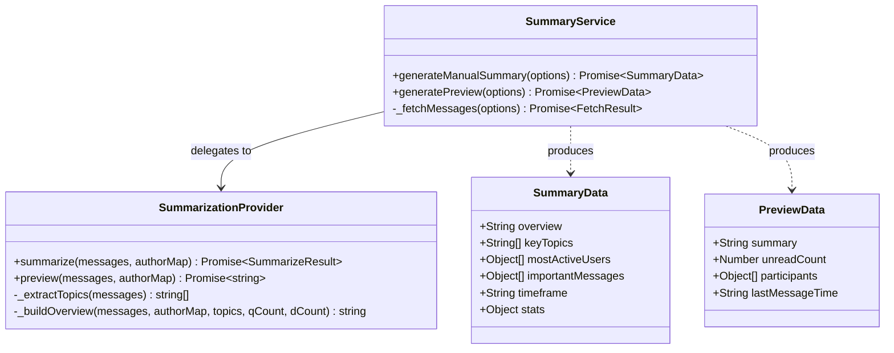

---

## 8. Search Module (User Story 3)

### 8.1 Features

- **Server search by name (US3):** Case-insensitive `ILIKE` search returning only servers the user is a member of.
- **Result ranking** by server name.
- **Pagination** via `limit` parameter.
- **Member count** included in results.

**Does not do:** Fuzzy matching, full-text search across messages, search history.

### 8.2 Internal Architecture

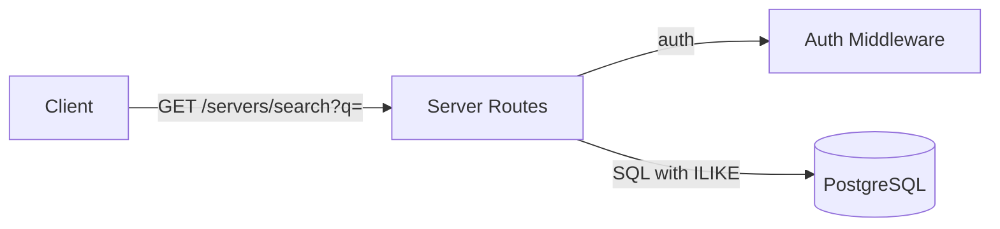

**Design justification:** Search is implemented directly in the Server routes file rather than a separate service because the query is a single SQL statement joining `servers` with `server_members`. This avoids an unnecessary abstraction layer for what is fundamentally a filtered read operation.

### 8.3 Data Abstraction

- **SearchResult** — `{ id, name, icon, owner_id, member_count, role }` — a server the user belongs to, matching the search query.

### 8.4 Stable Storage

Reads from `servers` and `server_members` tables. No dedicated search index — PostgreSQL `ILIKE` with the existing `idx_users_username` index provides adequate performance for the 10-user target.

### 8.5 Data Schema

No dedicated tables. Reads from `servers` (§3.5) and `server_members` (§3.5) tables using an `ILIKE` query joined with the membership filter.

### 8.6 API

| Method | Endpoint | Auth | Description |
|--------|----------|------|-------------|
| GET | `/api/servers/search?q=&limit=` | Yes | **US3** — Search servers by name |

**Response shape:**
```json
{
  "success": true,
  "data": {
    "servers": [
      {
        "id": "s1",
        "name": "Team Project",
        "icon": "🚀",
        "owner_id": "1",
        "member_count": 5,
        "role": "owner"
      }
    ]
  }
}
```

### 8.7 Class, Method, and Field Declarations

The search endpoint is a route handler in `routes/server.js` — no separate model or service class.

**Route handlers:**

| Handler | Method + Endpoint | Visibility |
|---------|-------------------|------------|
| `GET /search` | `GET /api/servers/search?q=&limit=` | **Public** (route) |

**Returned fields (SearchResult):**

| Field | Type | Visibility |
|-------|------|------------|
| `id` | `String` | **Public** |
| `name` | `String` | **Public** |
| `icon` | `String` | **Public** |
| `owner_id` | `String` | **Public** |
| `member_count` | `Number` | **Public** |
| `role` | `String` | **Public** |

### 8.8 Class Hierarchy Diagram

Search does not introduce new classes. It composes a SQL query over the Server and ServerMember entities defined in §3.8. See the Server Module class hierarchy for the underlying data model.

---

## 9. Friend Module

### 9.1 Features

- **List accepted friends** with profile information
- **List pending requests** (incoming and outgoing)
- **Send friend request** with duplicate/self-request prevention
- **Accept request** (to_user only)
- **Reject request** (to_user only)

**Does not do:** Block users, unfriend, friend suggestions.

### 9.2 Internal Architecture

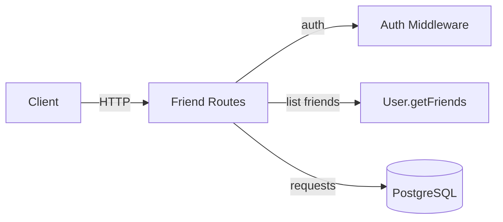

**Design justification:** Friend operations are implemented directly in route handlers because the logic is thin CRUD over the `friend_requests` table — no business rules complex enough to warrant a separate service layer. The accepted-friends query delegates to `User.getFriends`, which already exists in the User model for DM-related lookups, keeping the code DRY.

### 9.3 Data Abstraction

- **FriendRequest** — A directional request from one user to another, with status `pending`, `accepted`, or `rejected`. Acceptance implicitly makes the two users friends; there is no separate `friendships` table.
- **Friend** — A User entity returned by `User.getFriends()`. Two users are friends if a `friend_requests` row with status `accepted` exists between them in either direction.

### 9.4 Stable Storage

PostgreSQL `friend_requests` table. A `CHECK` constraint ensures `from_user_id != to_user_id`. The `status` column tracks the lifecycle of each request.

### 9.5 Data Schema

```sql
CREATE TABLE friend_requests (
    id           VARCHAR(255) PRIMARY KEY,
    from_user_id VARCHAR(255) NOT NULL REFERENCES users(id) ON DELETE CASCADE,
    to_user_id   VARCHAR(255) NOT NULL REFERENCES users(id) ON DELETE CASCADE,
    status       VARCHAR(20) DEFAULT 'pending'
                 CHECK (status IN ('pending','accepted','rejected')),
    created_at   TIMESTAMP DEFAULT CURRENT_TIMESTAMP,
    updated_at   TIMESTAMP DEFAULT CURRENT_TIMESTAMP,
    CHECK (from_user_id != to_user_id)
);
```

### 9.6 API

| Method | Endpoint | Auth | Description |
|--------|----------|------|-------------|
| GET | `/api/friends` | Yes | List accepted friends |
| GET | `/api/friends/requests` | Yes | List pending requests |
| POST | `/api/friends/requests` | Yes | Send friend request |
| POST | `/api/friends/requests/:id/accept` | Yes | Accept request |
| POST | `/api/friends/requests/:id/reject` | Yes | Reject request |

### 9.7 Class, Method, and Field Declarations

**Fields (friend_requests table):**

| Field | Type | Visibility |
|-------|------|------------|
| `id` | `VARCHAR(255)` | **Public** |
| `from_user_id` | `VARCHAR(255)` | **Public** |
| `to_user_id` | `VARCHAR(255)` | **Public** |
| `status` | `VARCHAR(20)` | **Public** (`pending`, `accepted`, `rejected`) |
| `created_at` | `TIMESTAMP` | **Public** |
| `updated_at` | `TIMESTAMP` | **Public** |

**Route handlers (public):**

| Handler | Method + Endpoint | Visibility |
|---------|-------------------|------------|
| `GET /` | `GET /api/friends` | **Public** |
| `GET /requests` | `GET /api/friends/requests` | **Public** |
| `POST /requests` | `POST /api/friends/requests` | **Public** |
| `POST /requests/:id/accept` | `POST /api/friends/requests/:id/accept` | **Public** |
| `POST /requests/:id/reject` | `POST /api/friends/requests/:id/reject` | **Public** |

**Model dependency:**

| Method | Source | Visibility |
|--------|--------|------------|
| `User.getFriends` | `models/User.js` | **Public** (reused from User module) |

### 9.8 Class Hierarchy Diagram

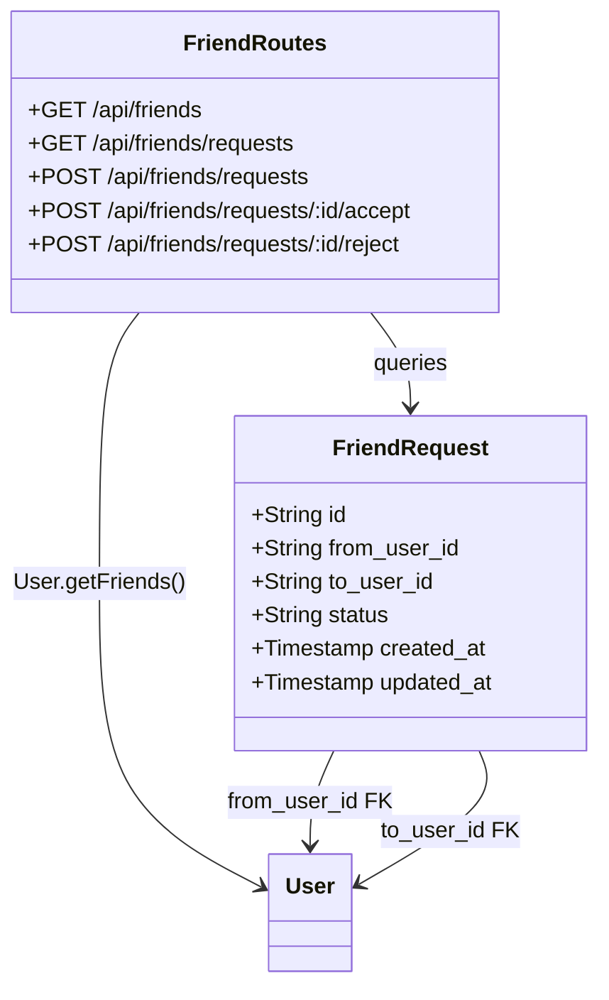

---

## 10. Server Invite Module

### 10.1 Features

- **List pending invites** for the current user
- **Send server invite** — validates membership, creates DM message automatically
- **Accept invite** — adds user to server
- **Decline invite** — marks as declined

**Does not do:** Invite links (URL-based), invite expiration, batch invites.

### 10.2 Data Abstraction

- **ServerInvite** — A directional invite from one user to another, tied to a specific server. Carries a status of `pending`, `accepted`, or `declined`. Accepting an invite triggers `Server.addMember()`.
- **InviteMessage** — The `messages` row (with `server_invite_id` set) automatically created in the DM between sender and recipient when the invite is sent.

### 10.3 Stable Storage

PostgreSQL `server_invites` table. The `message_id` column links back to the auto-generated DM message for display in the chat UI.

### 10.4 Internal Architecture

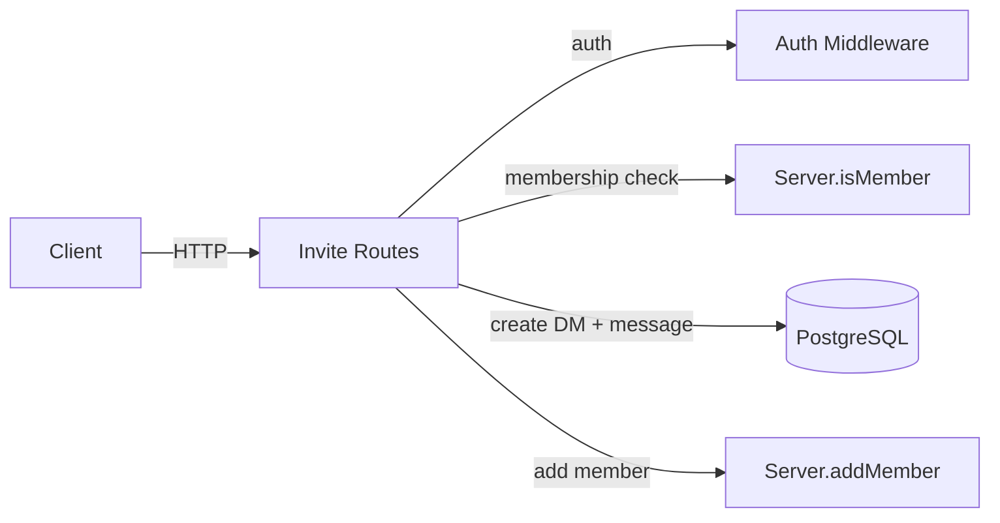

**Design justification:** Sending an invite is a multi-step transaction: validate membership, check for existing invite, find-or-create a DM, insert an invite message, then create the invite record. This is kept in a single route handler for transactional simplicity.

### 10.5 Data Schema

```sql
CREATE TABLE server_invites (
    id           VARCHAR(255) PRIMARY KEY,
    server_id    VARCHAR(255) NOT NULL REFERENCES servers(id) ON DELETE CASCADE,
    from_user_id VARCHAR(255) NOT NULL REFERENCES users(id) ON DELETE CASCADE,
    to_user_id   VARCHAR(255) REFERENCES users(id) ON DELETE CASCADE,
    status       VARCHAR(20) DEFAULT 'pending'
                 CHECK (status IN ('pending','accepted','declined')),
    message_id   VARCHAR(255) REFERENCES messages(id) ON DELETE SET NULL,
    created_at   TIMESTAMP DEFAULT CURRENT_TIMESTAMP,
    updated_at   TIMESTAMP DEFAULT CURRENT_TIMESTAMP
);
```

### 10.6 API

| Method | Endpoint | Auth | Description |
|--------|----------|------|-------------|
| GET | `/api/invites/pending` | Yes | List pending invites |
| POST | `/api/invites` | Yes | Send server invite |
| POST | `/api/invites/:id/accept` | Yes | Accept invite |
| POST | `/api/invites/:id/decline` | Yes | Decline invite |

### 10.7 Class, Method, and Field Declarations

**Fields (server_invites table):**

| Field | Type | Visibility |
|-------|------|------------|
| `id` | `VARCHAR(255)` | **Public** |
| `server_id` | `VARCHAR(255)` | **Public** |
| `from_user_id` | `VARCHAR(255)` | **Public** |
| `to_user_id` | `VARCHAR(255)` | **Public** |
| `status` | `VARCHAR(20)` | **Public** (`pending`, `accepted`, `declined`) |
| `message_id` | `VARCHAR(255)` | **Public** |
| `created_at` | `TIMESTAMP` | **Public** |
| `updated_at` | `TIMESTAMP` | **Public** |

**Route handlers (public):**

| Handler | Method + Endpoint | Visibility |
|---------|-------------------|------------|
| `GET /pending` | `GET /api/invites/pending` | **Public** |
| `POST /` | `POST /api/invites` | **Public** |
| `POST /:id/accept` | `POST /api/invites/:id/accept` | **Public** |
| `POST /:id/decline` | `POST /api/invites/:id/decline` | **Public** |

**Model dependencies:**

| Method | Source | Visibility |
|--------|--------|------------|
| `Server.isMember` | `models/Server.js` | **Public** |
| `Server.addMember` | `models/Server.js` | **Public** |

### 10.8 Class Hierarchy Diagram

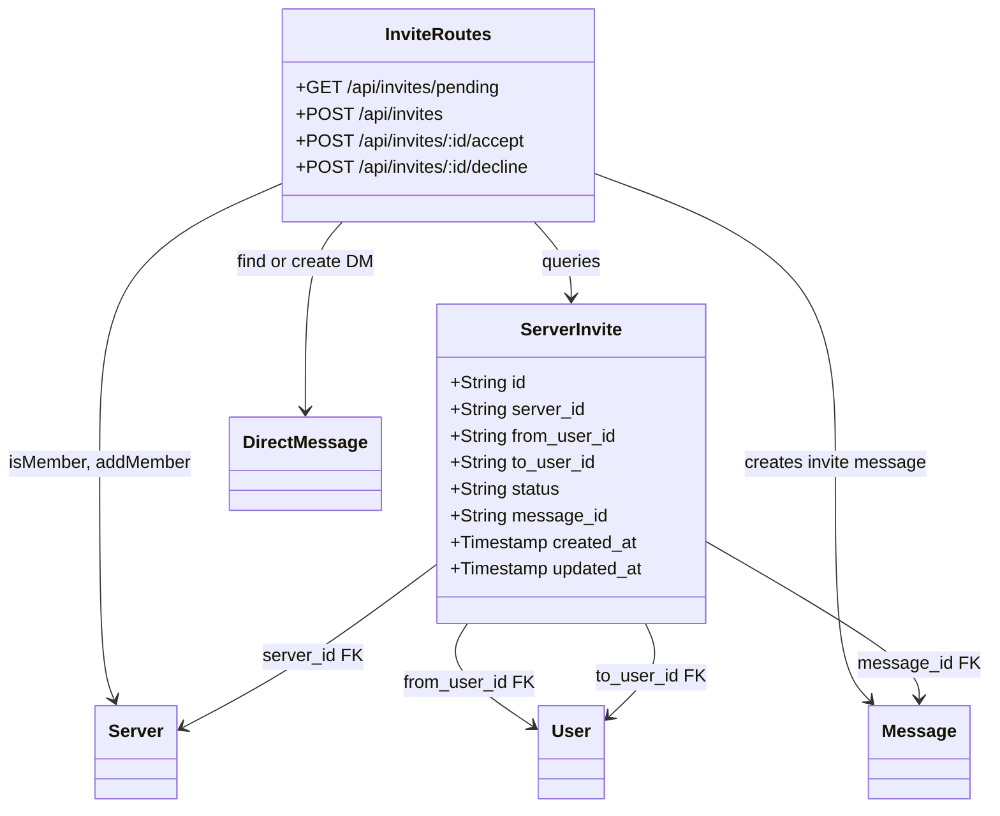
