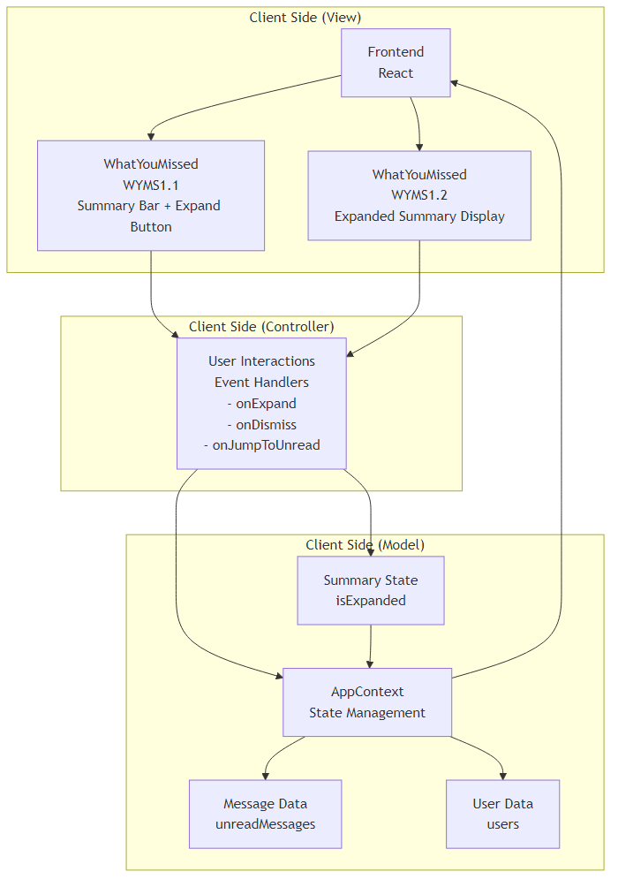
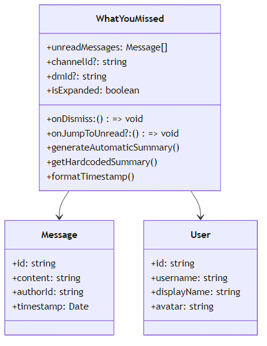
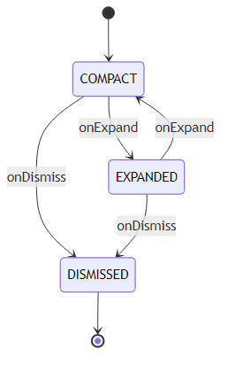
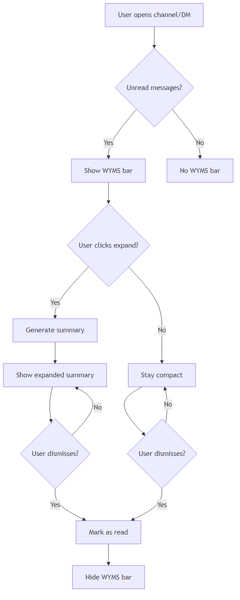

# Dev Specification Document
**Project:** Web‑Based Discord Clone with Enhanced Usability Features  
**Feature:** What You Missed Summary (WYMS)  
**Version:** v2.0

---

## 1. Document Version History

| Version | Date       | Editor        | Summary of Changes |
| :------ | :--------- | :------------ | :----------------- |
| **v0.1**| 2026‑02‑14 | James Mullins | Initial draft of Dev Spec header created. |
| **v0.2**| 2026‑02‑15 | James Mullins | Aligned preview feature to reuse manual summary infrastructure directly, along with rationales. |
| **v0.3**| 2026-02-16 | Elvis Valcarcel | Adjusted numbering in architecture to avoid conflicts with other devspecs |
| **v2.0**| 2026‑03‑04 | Salma Ghazi | Updated to MVC architecture with enhanced diagrams and consistent formatting |

### Authors & Contributors

| Name              | Role / Responsibility                    | Contributed Versions |
| :---------------- | :--------------------------------------- | :------------------- |
| **James Mullins** | Product Lead / Requirements Definition   | v0.1-2        |
| **Elvis Valcarcel** | Editor Extraordinaire | v0.3 |
| **Salma Ghazi** | Technical Update | v2.0 |

### Rationale & Justification
The header section clearly identifies what feature document covers and which project it belongs to as well. It also includes changes to documents and how it's tracked over time. This allows for traceability, revisions, and supports organization and maintainability throughout the development process.

## 2. Architecture Diagram

### 2.2 Architecture Description

The What You Missed Summary (WYMS) follows the **Model-View-Controller (MVC)** architecture pattern and **reuses the MS2.0 Message & Summarization Module from Manual Summary**:

#### **View Layer (Client Side)**
- **WYMS1.1 WhatYouMissed**: Single React component that displays the compact bar with unread count, participant avatars, expand button, and expanded summary view
- **Compact Bar**: Shows "What You Missed" label, unread count, timestamp, and action buttons
- **Expanded View**: Shows generated summary text and "Mark as read" button when expanded

#### **Controller Layer (Client Side)**
- **User Interactions**: Handled within the WhatYouMissed component via event handlers:
  - `onExpand`: Toggles `isExpanded` state (lines 143, 149)
  - `onDismiss`: Calls `onDismiss` callback to mark messages as read (lines 152, 167)
  - `onJumpToUnread`: Calls `onJumpToUnread` callback for navigation (line 134)

#### **Model Layer (Client Side - Reused from Manual Summary)**
- **MS2.1 SummaryService**: Reused concept for `generateAutomaticSummary` function (line 14)
- **MS2.2 SummarizationProvider**: Reused concept for LLM integration (hardcoded summaries in `getHardcodedSummary`)
- **MS2.3 MessageRepository**: Reused concept via AppContext `useApp()` hook (line 83)
- **MS2.6 MembershipService**: Reused concept for access control via AppContext

#### **State Management**
- **Local State**: `isExpanded` boolean managed with `useState` (line 84)
- **Global State**: `users` array from AppContext via `useApp()` hook (line 83)
- **Props**: `unreadMessages`, `onDismiss`, `onJumpToUnread`, `channelId`, `dmId` (lines 6-12)

#### **MVC Data Flow**
1. **View → Controller**: User clicks expand/dismiss/jump buttons trigger local event handlers
2. **Controller → Model**: Event handlers update local `isExpanded` state or call prop callbacks
3. **Model → View**: AppContext provides `users` data; props provide `unreadMessages`
4. **Summary Generation**: `generateAutomaticSummary` function processes messages and users locally (client-side)

This architecture uses a single React component that handles both View and Controller responsibilities, while leveraging AppContext for Model data and reusing summarization concepts from manual summary.

### Rationale and Justification:
This architecture follows MVC (Model-View-Controller) pattern and maximizes component reuse from the existing manual summary feature. The MS2.0 Message & Summarization Module provides the core summarization functionality, while WYMS adds specific UI components and orchestration services for automatic display.

## 3. Class Diagrams

**Actual Implementation (Single Component):**

**Class: WYMS1.1 WhatYouMissed**
* **Props Interface**: `WhatYouMissedProps` (lines 6-12)
  - `unreadMessages: Message[]` - Array of unread messages
  - `onDismiss: () => void` - Callback to mark messages as read
  - `onJumpToUnread?: () => void` - Optional callback for navigation
  - `channelId?: string` - Optional channel identifier
  - `dmId?: string` - Optional DM identifier
* **Local State**: `isExpanded: boolean` (line 84)
* **Global State**: `users: User[]` from AppContext (line 83)
* **Key Functions**:
  - `generateAutomaticSummary(messages, users)` - Client-side summary generation (line 14)
  - `getHardcodedSummary(channelId, dmId)` - Hardcoded summaries for testing (line 45)
  - `formatTimestamp(date)` - Time formatting utility (line 65)

**Reused Concepts from Manual Summary (MS2.0 Module):**

**MS2.1 SummaryService Concept**
* **Implemented as**: `generateAutomaticSummary` function (line 14)
* **Functionality**: Analyzes message patterns, user activity, and mentions
* **Output**: String summary of recent activity

**MS2.2 SummarizationProvider Concept**
* **Implemented as**: `getHardcodedSummary` function (line 45)
* **Functionality**: Provides predefined summaries for specific channels/DMs
* **Purpose**: Testing and demonstration of LLM integration concept

**MS2.3 MessageRepository Concept**
* **Implemented as**: AppContext `useApp()` hook (line 83)
* **Functionality**: Provides access to user data for name resolution
* **Data Source**: Global application state

**MS2.6 MembershipService Concept**
* **Implemented as**: Implicit through AppContext access
* **Functionality**: User authentication and data access
* **Purpose**: Security and access control

### Rationale and Justification:
The actual implementation uses a single React component that combines View and Controller responsibilities, while leveraging AppContext for Model data. The summarization concepts from manual summary are implemented as local functions within the component, maintaining the spirit of code reuse while using a simpler, more direct approach suitable for the current codebase.

## 4. List of Classes

### Actual Implementation: Single React Component

**Class: WYMS1.1 WhatYouMissed**
* **Purpose & Responsibility:** Single React component that displays "What You Missed" summary for unread messages. Shows compact bar with expand functionality and handles all user interactions locally.
* **Implements Design Features:** What You Missed Summary (complete UI), Automatic summary generation, Expandable interface, User interaction handling.
* **Props:** `unreadMessages`, `onDismiss`, `onJumpToUnread`, `channelId`, `dmId`
* **State:** `isExpanded` boolean for expand/collapse functionality
* **Data Sources:** AppContext for users, props for messages and callbacks

### Reused Concepts from Manual Summary (MS2.0 Module)

**MS2.1 SummaryService Concept**
* **Purpose & Responsibility:** Summarization logic implemented as `generateAutomaticSummary` function. Analyzes message patterns, user activity counts, and mentions to create concise summaries.
* **Implements Design Features:** What You Missed Summary (automatic generation), Component reuse concept, Client-side processing.

**MS2.2 SummarizationProvider Concept**
* **Purpose & Responsibility:** LLM integration concept implemented as `getHardcodedSummary` function. Provides predefined summaries for specific channels/DMs for testing and demonstration.
* **Implements Design Features:** What You Missed Summary (LLM concept), Component reuse concept, Testing support.

**MS2.3 MessageRepository Concept**
* **Purpose & Responsibility:** Data access concept implemented via AppContext `useApp()` hook. Provides user data for name resolution and avatar display.
* **Implements Design Features:** What You Missed Summary (user data access), Component reuse concept, Global state management.

**MS2.6 MembershipService Concept**
* **Purpose & Responsibility:** Access control concept implemented implicitly through AppContext authentication. Ensures user has appropriate access to message data.
* **Implements Design Features:** What You Missed Summary (access control), Component reuse concept, Security validation.

### Rationale and Justification:
The actual implementation uses a pragmatic approach with a single React component that handles all responsibilities while maintaining the conceptual reuse of manual summary components. The MS2.0 concepts are implemented as local functions and AppContext usage, providing a simpler but effective architecture that aligns with the current codebase structure.

## 5. State Diagrams

## 6. Flow Charts (Scenario‑Based)

#### Scenario: WYMS1.0 User Views Unread Messages
**Starting State:** COMPACT
**Ending State:** COMPACT

1. **[Start]** → **[State]** COMPACT
2. **[Input/Output]** User opens channel/DM with unread messages
3. **[Process]** Get `unreadMessages` and `users` from AppContext
4. **[Process]** Generate automatic summary
5. **[Decision]** `unreadMessages.length > 0?`
    * **Yes** → **[View]** Display WYMS bar with unread count → **(End)**
    * **No** → **[Process]** Hide WYMS bar → **(End)**

**Explanation:** The WYMS bar appears when there are unread messages, showing the count and participant avatars.

#### Scenario: WYMS1.1 User Expands Summary
**Starting State:** COMPACT
**Ending State:** EXPANDED

1. **[Start]** → **[State]** COMPACT
2. **[Input]** User clicks expand button → **[Controller]** `onExpand` event triggered
3. **[Process]** Controller updates `isExpanded` state in AppContext (Model)
4. **[Process]** Transition to EXPANDED
5. **[View]** Display expanded summary with full text → **(End)**

**Explanation:** Clicking expand triggers the `onExpand` event handler, which updates the `isExpanded` state in the Model, showing the detailed summary.

#### Scenario: WYMS1.2 User Dismisses Summary
**Starting State:** COMPACT OR EXPANDED
**Ending State:** DISMISSED

1. **[Start]** → **[State]** COMPACT OR EXPANDED
2. **[Input]** User clicks dismiss button → **[Controller]** `onDismiss` event triggered
3. **[Process]** Controller calls `onDismiss` callback
4. **[Process]** Mark all messages as read
5. **[Process]** Transition to DISMISSED
6. **[Process]** Hide WYMS bar → **(End)**

**Explanation:** Clicking dismiss triggers the `onDismiss` event handler, which marks all messages as read and hides the WYMS component.

### Rationale and Justification:
The flow charts cover all primary user interactions with the WYMS component: viewing unread messages, expanding summaries, and dismissing summaries. These scenarios represent the complete user journey through the automatic summary functionality.

## 7. Possible Threats and Failures

### Component: WYMS1.0 What You Missed Components (View)

| Failure Mode | Description | Recovery Procedure | Likelihood | Impact |
| :--- | :--- | :--- | :--- | :--- |
| **FM‑WYMS1‑01 Runtime Crash** | UI rendering or component logic triggers an unrecoverable exception. | Restart client view lifecycle, reinitialize component state. | Medium | High |
| **FM‑WYMS1‑02 Loss of Runtime State** | Active expansion state lost during UI updates. | Rehydrate state from last known AppContext snapshot. | High | Medium |
| **FM‑WYMS1‑03 Unexpected State Transition** | UI enters incorrect state (e.g., expanded without messages). | Force state recomputation via component re-render. | Medium | Medium |
| **FM‑WYMS1‑04 Resource Exhaustion (Client)** | Excessive DOM updates degrade performance. | Throttle render cycles, debounce expand events. | Medium | Medium |

### Component: WYMS2.0 User Interactions (Controller)

| Failure Mode | Description | Recovery Procedure | Likelihood | Impact |
| :--- | :--- | :--- | :--- | :--- |
| **FM‑WYMS2‑01 Event Handling Errors** | `onExpand`, `onDismiss`, or `onJumpToUnread` handlers fail to execute properly. | Reset event handlers, clear pending timeouts, restore last known state. | Medium | Medium |
| **FM‑WYMS2‑02 Expansion State Issues** | `isExpanded` state becomes out of sync with UI display. | Re-sync state from DOM value, clear corrupted state. | Medium | Medium |

### Component: WYMS3.0 App Context (Model)

| Failure Mode | Description | Recovery Procedure | Likelihood | Impact |
| :--- | :--- | :--- | :--- | :--- |
| **FM‑WYMS3‑01 Data Corruption** | `unreadMessages` array or `users` data becomes inconsistent. | Invalidate context, refetch from source API. | Low | High |
| **FM‑WYMS3‑02 State Loss** | `isExpanded`, `unreadMessages`, or `users` state cleared unexpectedly. | Restore from localStorage or re-initialize from API. | Medium | High |
| **FM‑WYMS3‑03 Summary Generation Errors** | Automatic summary generation fails due to malformed data. | Fallback to hardcoded summary, log error for debugging. | Medium | Medium |

### Connectivity Failures

* **FM‑CON‑01 Network Loss:** Unread message data unavailable. *Recovery:* Use cached context data.
* **FM‑CON‑02 Third‑Party Service Failure:** Missing user avatars. *Recovery:* Use placeholder assets.

### Ranking Summary

| Rank Category | Typical Failures |
| :--- | :--- |
| **High Likelihood / Medium Impact** | Loss of Runtime State, Event Handling Errors, Expansion State Issues |
| **Medium Likelihood / High Impact** | Runtime Crash, State Loss, Summary Generation Errors |
| **Low Likelihood / Critical Impact** | Data Corruption |

### Rationale and Justification:
Failure modes are categorized by MVC components, focusing on client-side issues since the WYMS functionality is entirely browser-based. Recovery procedures emphasize state restoration and graceful degradation.

## 8. Technologies

| Technology | Version | Purpose | Justification vs Alternatives |
| :--- | :--- | :--- | :--- |
| **[TECH‑01 TypeScript](https://www.typescriptlang.org/docs/)** | 5.x | Client logic/UI | Static typing improves maintainability vs plain JS and aligns with component interfaces. |
| **[TECH‑02 React](https://react.dev/)** | 18.x | UI Framework | Component model maps to View components; state management fits Model layer; strong ecosystem. |
| **[TECH‑03 Lucide React](https://lucide.dev/)** | Latest | Icons | Consistent iconography for expand, dismiss, and jump buttons vs custom SVGs. |
| **[TECH‑04 Tailwind CSS](https://tailwindcss.com/)** | 3.x | Styling | Utility-first CSS for responsive WYMS UI vs traditional CSS frameworks. |

### Rationale and Justification:
Technology stack optimized for client-side MVC architecture pattern. React handles View components (WYMS1.0), TypeScript provides Controller logic (WYMS2.0) type safety for event handlers, and AppContext serves as the Model (WYMS3.0). All technologies support the browser-only deployment model with real-time summary functionality.

## 9. APIs & Public Interfaces

### Component: WYMS1.0 What You Missed Components (View)

#### Class: WYMS1.1 WhatYouMissed
* **Public Methods**
    * `render() : ReactElement`
    * `handleExpand() : void` - Triggers `onExpand` event
    * `handleDismiss() : void` - Triggers `onDismiss` event
    * `handleJumpToUnread() : void` - Triggers `onJumpToUnread` event
* **Event Handlers**
    * `onExpand: () => void`
    * `onDismiss: () => void`
    * `onJumpToUnread?: () => void`

### Component: WYMS2.0 User Interactions (Controller)

#### Class: WYMS2.0 UserInteractions
* **Public Methods**
    * `onExpand() : void` - Updates expansion state in AppContext
    * `onDismiss() : void` - Marks messages as read in AppContext
    * `onJumpToUnread() : void` - Navigates to first unread message
* **State Management**
    * Updates `isExpanded` state in AppContext
    * Triggers message read status updates
    * Handles navigation to unread messages

### Component: WYMS3.0 App Context (Model)

#### Class: WYMS3.0 AppContext
* **Public Methods**
    * `getUnreadMessages() : Message[]` - Returns unread messages for summary
    * `getUsers() : User[]` - Returns user context for name resolution
    * `getIsExpanded() : boolean` - Returns current expansion state
    * `setIsExpanded(expanded: boolean) : void` - Updates expansion state
    * `markMessagesAsRead() : void` - Updates message read status
* **State Properties**
    * `unreadMessages: Message[]` - Unread message list
    * `users: User[]` - Complete user list
    * `isExpanded: boolean` - Current expansion state

### Data Structures

#### Class: WYMS3.1 MessageData
* **Public Methods**
    * `getId() : string`
    * `getContent() : string`
    * `getAuthorId() : string`
    * `getTimestamp() : Date`

#### Class: WYMS3.2 UserData
* **Public Methods**
    * `getId() : string`
    * `getUsername() : string`
    * `getDisplayName() : string`
    * `getAvatar() : string`

### Rationale and Justification:
API interfaces follow MVC separation with View components exposing rendering methods, Controller handling user interactions, and Model providing data access methods. This maintains clean architectural boundaries.

## 10. Public Interfaces

### Component: WYMS1.0 What You Missed Components (View)

**External Dependencies — WYMS1.0 Uses:**
* **From WYMS2.0 User Interactions (Controller):** Event handling and user interaction processing.
* **From WYMS3.0 App Context (Model):** Unread message data and navigation state management.

### Component: WYMS2.0 User Interactions (Controller)

**External Dependencies — WYMS2.0 Uses:**
* **From WYMS1.0 What You Missed Components (View):** User input capture and result display via `onExpand`, `onDismiss`, `onJumpToUnread` events.
* **From WYMS3.0 App Context (Model):** State updates for `isExpanded`, `unreadMessages`, and `users` data.

### Component: WYMS3.0 App Context (Model)

**Public Methods Exposed to WYMS1.0 and WYMS2.0:**
* `getUnreadMessages()` — Provides message list for summary generation.
* `getUsers()` — Provides user context for name resolution.
* `getIsExpanded()` — Provides current expansion state.
* `setIsExpanded()` — Updates expansion state from Controller events.
* `markMessagesAsRead()` — Updates message read status from dismiss action.

### Rationale and Justification:
Public interfaces maintain MVC separation with clear dependencies between View, Controller, and Model components. The Model exposes data access methods while Controller coordinates interactions.

## 11. Data Schemas

### Database Data Type: DS‑01 MessageRecord
* **Primary Runtime Owner:** WYMS3.0 AppContext (Model)
* **Description:** Persistent representation of messages loaded into client-side state for summary generation.

**Columns:**
* `message_id` (UUID): Primary key.
* `channel_id` (UUID): Foreign key to channel.
* `dm_id` (UUID): Foreign key to direct message.
* `author_id` (UUID): Foreign key to user.
* `content` (TEXT): Message content.
* `timestamp` (TIMESTAMP): Message creation time.
* `read_status` (BOOLEAN): Whether message is read.

### Database Data Type: DS‑02 UserRecord
* **Primary Runtime Owner:** WYMS3.0 AppContext (Model)
* **Description:** User authentication and profile data for name resolution and avatar display in summaries.

**Columns:**
* `user_id` (UUID): Primary key.
* `username` (VARCHAR 50): Display name.
* `display_name` (VARCHAR 100): Preferred display name.
* `avatar_url` (TEXT): Profile picture URL.
* `created_at` (TIMESTAMP): Registration timestamp.

### Database Data Type: DS‑03 UserMessageStatusRecord
* **Primary Runtime Owner:** WYMS3.0 AppContext (Model)
* **Description:** Tracks which messages are unread for each user to determine WYMS display.

**Columns:**
* `user_id` (UUID): Foreign key to user.
* `message_id` (UUID): Foreign key to message.
* `read_at` (TIMESTAMP): When message was marked as read.
* `is_unread` (BOOLEAN): Current unread status.

### Rationale and Justification:
Data schemas support the MVC Model layer with normalized relationships between users, messages, and read status. UUIDs ensure global uniqueness while timestamps track data lifecycle for accurate summary generation.

## 12. Risks to Completion

### MVC Component-Level Risks

**WYMS1.0 What You Missed Components (View)**
* **Rendering Performance:** Frequent re-renders during message updates may cause UI lag.
* **Accessibility Issues:** Screen reader support for dynamic summary content.
* **Browser Compatibility:** Expand/collapse animation differences across browsers.

**WYMS2.0 User Interactions (Controller)**
* **Event Handling Complexity:** Managing `onExpand`, `onDismiss`, and `onJumpToUnread` events with proper debouncing.
* **Race Conditions:** Multiple rapid interactions causing inconsistent `isExpanded` state.
* **State Update Timing:** Ensuring Controller updates Model before View re-renders.

**WYMS3.0 App Context (Model)**
* **State Synchronization:** Ensuring consistent `isExpanded`, `unreadMessages`, and `users` state across components.
* **Memory Leaks:** Context subscriptions not properly cleaned up when components unmount.
* **Data Integrity:** Maintaining accurate unread message tracking for summary generation.

### Technology Risks

**React State Management**
* **Re-rendering Issues:** Unnecessary component updates affecting summary performance.
* **Hook Dependencies:** Complex useEffect dependencies for `isExpanded` state management.
* **Context Provider Scope:** Ensuring AppContext properly wraps WYMS components.

**Browser API Limitations**
* **Animation Performance:** CSS transition differences for expand/collapse effects.

### Integration Risks

* **Context Provider Setup:** Ensuring AppContext is available to all WYMS components.
* **Message Data Consistency:** Maintaining accurate unread message counts across navigation.

### Mitigation Strategies

* Comprehensive unit testing for each MVC layer.
* Integration testing for component interactions.
* Performance monitoring and optimization.
* Cross-browser testing and polyfills.

## 13. Security & Privacy

### Temporary Handling of PII

**PII Elements**
* `user_id` - User identification for message tracking in Model.
* `username` - Display name in summary results (View).
* `message content` - Message text used for automatic summary generation.
* `unread status` - Message read state tracking.

**Justification**
* Required for generating accurate and personalized summaries.
* Essential for displaying relevant participant information.

**Data Flow**
1. User opens channel/DM → View (WYMS1.1) captures unread messages → Controller (WYMS2.0) processes events
2. Controller updates `isExpanded` state in Model (WYMS3.0 AppContext) → Summary generation occurs client-side
3. Model provides filtered results to View (WYMS1.2) → No server transmission of summary data

**Protection Mechanisms**
* Client-side only processing - no server transmission of summaries.
* Data remains in browser memory only.
* No persistent storage of generated summaries.

### Long-Term Storage of PII

**Stored Data**
* User-message read status relationships.
* Message content and metadata.
* User profile information.

**Storage Method**
* PostgreSQL database with proper indexing.
* Encrypted connections and access controls.

**Data Exit Paths**
* AppContext data loading for summary generation.
* Message read status updates.

### Security Responsibilities

* **Client Security:** Input validation and XSS prevention in summary display.
* **Data Security:** Database access controls and encryption.
* **Network Security:** HTTPS transport encryption.

### Privacy Considerations

* No summary generation logging or analytics.
* Client-side processing prevents server-side data exposure.
* Minimal data retention focused on functionality.

### Rationale and Justification:
Security measures prioritize user privacy by keeping summary generation client-side. No generated summaries are transmitted to servers, reducing privacy risks while maintaining functionality. MVC architecture supports clean separation of security concerns.
